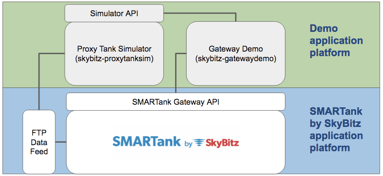

# skybitz-gatewaydemo

A basic consuming application created to demonstrate the use of the SMARTank by SkyBitz Gateway web service.

## Usage
This is a pure python program to demonstrate the use of the Gateway API to get the latest tank and inventory data only. This is intended as a simple starting point for technical reference when building a consuming application. I recommend you read more about the Gateway in this [overiew guide](docs/TankData_Gateway_Overview_Guide.pdf) from SkyBitz Tank Monitoring. Gateway credentials are required; contact SkyBitz Sales or Support for access.

This demo example is designed to wake up on a regular frequency (typically once per hour) to check current tank records for my organization and save up-to-date inventory records for each. Using the documented SOAP calls prescribed by the Gateway service, this application creates standard json formatted files as local data from the resulting reponses. 

When used in conjuction with my Proxy Tank Demo, this Gateway Demo application is designed to automatically update the simulated tank when a Critical Alarm is received. My Proxy Tank Simulator project can be found on GitHub [here](https://github.com/knightman/skybitz-proxytanksim).

For more details about SMARTank, please visit [http://www.skybitz.com/tank-monitoring](http://www.skybitz.com/tank-monitoring)

## Release History

* 2017.03 - v0.1
    * Initial working beta
* 2017.04 - v0.2
    * Multiple tests added, updated documentation
    * Connection with Proxy Tank Sim API completed

## Credits
Developed & maintained by Andrew Knight

## About
See requirements.txt for package dependencies.

Distributed under the MIT License. See ``LICENSE`` for more information.

[https://github.com/knightman/skybitz-gatewaydemo](https://github.com/knightman/skybitz-gatewaydemo)